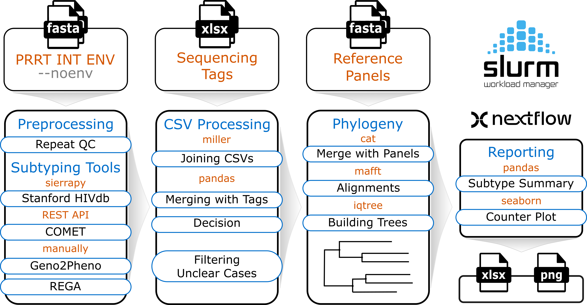

# HIVtype: A Semi-Automated Workflow for HIV-1 Subtyping

The aim of a pipeline is to automate a routine HIV-1 subtyping analysis, using Stanford (SierraPy), Comet (Rest API), Rega (manually generated .csv files via click or drop) and Geno2Pheno (manually generated .csv files via click or drop) tools. The pipeline is built using Nextflow and contains both established software and custom Python scripts. 

## Pipeline workflow



## Input structure
Inputs of the pipeline include the following files:

- (required) .fasta files (fused PRRT, INT, ENV or fused PRRT and INT )
- (required) .csv files (manually generated, using Rega online tool)
- (required) .csv files (manually generated, using Geno2Pheno online tool)
- (provided) .fasta files of reference panels (subtype_origin_year_accession)
- (optional) .xlsx files (HIVpipe, contain information for invalid sequences)

  
```sh
├── InputFasta
│   ├── 2024_ENV_20.fasta
│   ├── 2024_INT_20.fasta
│   └── 2024_PRRT_20.fasta
├── Rega
│   ├── Manual_Rega_2024_ENV_20M.csv
│   ├── Manual_Rega_2024_INT_20M.csv
│   └── Manual_Rega_2024_PRRT_20M.csv
├── Geno2Pheno
│   ├── Manual_Geno2Pheno_2024_ENV_20M.csv
│   ├── Manual_Geno2Pheno_2024_INT_20M.csv
│   └── Manual_Geno2Pheno_2024_PRRT_20M.csv
├── References
│   ├── Reference_ENV_Panel.fas
│   ├── Reference_INT_Panel.fas
│   └── Reference_PRRT_Panel.fas
```

## Output
A decision is made based on a combination of three publicly available subtyping tools. Records with unclear or ambiguous subtypes are sorted and concatenated with the Stanford reference panels followed by a multiple suquence alignment (msa) via MAFFT. MSA samples are analysed, using IQTREE to make a final decision and respective updates.

A final output of the pipeline is an .xlsx file and a barplot. The pipeline is supposed to be used for each sequencing run of 96 samples, including control samples, but can handle up 2000 sequences. 

An initial pipeline design was meant to process all three fragments (PRRT, INT, and ENV). The curresnt version of the pipeline can manage either 3 fragments or 2 (PRRT and INT), using a parameter **--noenv**.

## Istallation

Clone a repo with **HiVtype** pipeline

```sh
git clone https://github.com/vera-rykalina/rki_subtyping.git
```

Create a hivtype environment, using **hivtype.yml** file:

```sh
conda env create -n hivtype -f docs/hivtype.yml
```

Activate the *hivtype* environment:
```sh
conda activate hivtype
```

## Usage

Add required inputs files within **inputs** folter: 

- populate **InputFasta** with FASTA files for PRRT, INT, and ENV.

- populate **Rega** and **Geno2Pheno** folders with respective csv files.


Run the pipeline: 

```sh
nextflow hivtype.nf -c hivtype.config -profile rki_slurm --full --iqtree --report --outdir 2024 -resume
```